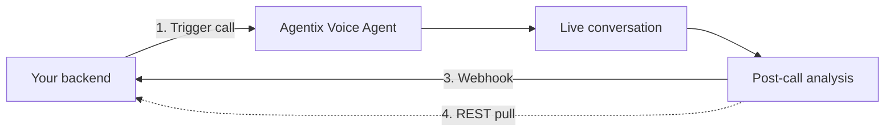

import AuthCallout from "/snippets/auth-callout.mdx";

<AuthCallout />

Agentix exposes a programmatic call surface that lets your backend dial out, drive the conversation with per-call context, and pull structured analysis back when the call ends. This guide walks through the end-to-end loop — agent configuration, the trigger API, webhook delivery, and the session-detail endpoints.

## The end-to-end loop

1. **Configure the agent.** Define the system prompt with `{{placeholders}}` and turn on the post-call analysis fields you want returned (intent, resolution, sentiment, structured data extraction).
2. **Trigger the call.** `POST /api/v1/phone-numbers/{phone_number_id}/calls/start` with the destination number, `agent_id`, and a free-form `session_variables` map.
3. **Receive a webhook.** Agentix calls your registered endpoint on `session.created` and `session.ended`. Use the echoed `session_variables` to map the call back to your CRM record.
4. **Pull full details (optional).** `GET /api/v1/chat/sessions/{id}` and `/messages` to fetch the full transcript and analysis when you need more than the webhook summary.



The two prerequisite pages for this guide:

<CardGroup cols={2}>
  <Card title="Session variables" icon="brackets-curly" href="/guides/session-variables">
    How `{{placeholders}}` in the system prompt are resolved from `session_variables` and built-in `system.*` values.
  </Card>
  <Card title="Post-call analysis" icon="chart-line" href="/guides/post-call-analysis">
    Configure intent, resolution, sentiment, and data-extraction so the webhook carries structured fields, not raw transcript.
  </Card>
</CardGroup>

## Find the IDs you need

To kick off a call programmatically you need three things plus your `session_variables`:

- **`agent_id`** — which agent to use.
- **`phone_number_id`** — which outbound number to dial from.
- **`to_phone_number`** — destination number in E.164 format.

### Finding the `agent_id`

Open the agent in the Agentix dashboard. The ID is surfaced in two places on the agent detail screen:

1. **Header line** — directly under the agent name, shown as `ID: d796…953a` with a copy icon.
2. **Browser URL** — the path is `app.agntix.ai/en/agents/<agent_id>`, so the last segment is the ID.

Example: `d796c919-7ef3-413a-8bf1-351b6442953a`.

### Finding the `phone_number_id`

Call the phone-numbers listing endpoint. This returns every outbound number provisioned to your org along with its UUID:

```bash
curl https://api.agntix.ai/api/v1/phone-numbers?size=50 \
  -H "x-api-key: $AGNTIX_API_KEY" \
  -H "Accept: application/json"
```

Sample response shape:

```json
{
  "items": [
    {
      "id": "fba8677f-e464-4362-ba4f-55bbdc3dab94",
      "phone_number": "+9714XXXXXXX",
      "provider": "...",
      "label": "Outbound-Dubai"
    }
  ]
}
```

Use the `id` of the number you want to dial from. The IDs are stable — cache them once on your side.

## Trigger the call

`POST /api/v1/phone-numbers/{phone_number_id}/calls/start`

**Path parameters**

<ParamField path="phone_number_id" type="string" required>
  The UUID of the outbound phone number to dial from.
</ParamField>

**Body parameters**

<ParamField body="to_phone_number" type="string" required>
  Destination number in E.164 format (e.g. `+971501234567`).
</ParamField>
<ParamField body="agent_id" type="string" required>
  UUID of the agent that will drive the conversation.
</ParamField>
<ParamField body="ttl" type="integer" default="100">
  Maximum call duration in seconds. The call is force-terminated when this elapses.
</ParamField>
<ParamField body="session_variables" type="object">
  Free-form key/value map. Every key is available as `{{key}}` in the system prompt **and** is echoed back verbatim in webhooks regardless of whether the prompt referenced it. Use this for both prompt context **and** correlation IDs.
</ParamField>

<CodeGroup>

```bash cURL
curl -X POST 'https://api.agntix.ai/api/v1/phone-numbers/fba8677f-e464-4362-ba4f-55bbdc3dab94/calls/start' \
  -H "x-api-key: $AGNTIX_API_KEY" \
  -H 'Content-Type: application/json' \
  -H 'Accept: application/json' \
  -d '{
    "to_phone_number": "+971501234567",
    "agent_id": "d796c919-7ef3-413a-8bf1-351b6442953a",
    "ttl": 180,
    "session_variables": {
      "customerName": "Alex Morgan",
      "contextSummary": "Order #88291, placed 2026-05-09, status shipped, ETA 2026-05-14",
      "objective": "Confirm delivery slot and capture preferred time",
      "crmContactId": "CRM-7728"
    }
  }'
```

```javascript Node.js
const res = await fetch(
  `https://api.agntix.ai/api/v1/phone-numbers/${phoneNumberId}/calls/start`,
  {
    method: "POST",
    headers: {
      "x-api-key": process.env.AGNTIX_API_KEY,
      "Content-Type": "application/json",
      Accept: "application/json",
    },
    body: JSON.stringify({
      to_phone_number: "+971501234567",
      agent_id: "d796c919-7ef3-413a-8bf1-351b6442953a",
      ttl: 180,
      session_variables: {
        customerName: "Alex Morgan",
        contextSummary: "Order #88291, placed 2026-05-09, status shipped, ETA 2026-05-14",
        objective: "Confirm delivery slot and capture preferred time",
        crmContactId: "CRM-7728",
      },
    }),
  },
);
const { sessionId } = await res.json();
```

```python Python
import os, requests

phone_number_id = "fba8677f-e464-4362-ba4f-55bbdc3dab94"

res = requests.post(
    f"https://api.agntix.ai/api/v1/phone-numbers/{phone_number_id}/calls/start",
    headers={
        "x-api-key": os.environ["AGNTIX_API_KEY"],
        "Content-Type": "application/json",
        "Accept": "application/json",
    },
    json={
        "to_phone_number": "+971501234567",
        "agent_id": "d796c919-7ef3-413a-8bf1-351b6442953a",
        "ttl": 180,
        "session_variables": {
            "customerName": "Alex Morgan",
            "contextSummary": "Order #88291, placed 2026-05-09, status shipped, ETA 2026-05-14",
            "objective": "Confirm delivery slot and capture preferred time",
            "crmContactId": "CRM-7728",
        },
    },
)
session_id = res.json()["sessionId"]
```

</CodeGroup>

The response contains a `sessionId` you can store immediately for correlation. The same ID flows in webhooks and in the session GET API.

## Map a call back to your CRM

This is the most important design point.

Production traffic almost always means **many parallel calls**. Webhooks arrive asynchronously and order is not guaranteed. To map each webhook back to its originating task, **include a unique identifier in `session_variables`** at trigger time:

```json
"session_variables": {
  "crmContactId": "CRM-7728",
  "campaignId":   "CAMP-2026-05-13-001",
  "taskId":       "TASK-9911"
}
```

These keys are **echoed back verbatim** under `metadata.sessionVariables` in the webhook — **regardless of whether the agent prompt actually referenced them**. So they double as pure correlation IDs without polluting the prompt.

When your endpoint receives a `session.ended` event:

1. Read `webhook.metadata.sessionVariables.crmContactId`.
2. Look up the contact in your DB.
3. Persist `analysis.*` fields against the contact / task.
4. If transcripts are needed, fetch via the session messages API.

See [Webhook events](/webhooks/events) for the full `session.created` and `session.ended` payload schemas.

## Fetch full session details

When you need the full picture — transcript turns, tool calls, raw recording — pull from the chat session API using the session ID from the webhook.

```bash
curl https://api.agntix.ai/api/v1/chat/sessions/$SESSION_ID \
  -H "x-api-key: $AGNTIX_API_KEY" \
  -H "Accept: application/json"

curl https://api.agntix.ai/api/v1/chat/sessions/$SESSION_ID/messages \
  -H "x-api-key: $AGNTIX_API_KEY" \
  -H "Accept: application/json"
```

<Tip>
**Don't poll. Pull-on-event.**

1. Receive `session.ended` webhook.
2. Persist the summary fields immediately (for dashboards).
3. Asynchronously fetch `/sessions/{id}` and `/sessions/{id}/messages` and stash in object storage (S3/GCS) for the reviewer UI.
</Tip>

## End-to-end example

The full lifecycle for **one** outbound call:

```text
┌─ Your backend ─────────────────────────────────────────────┐
│                                                            │
│ 1. Pick task TASK-9911 + contact +971501234567             │
│ 2. Build contextSummary string from your DB                │
│ 3. POST /phone-numbers/<id>/calls/start                    │
│    body.session_variables.crmContactId = "CRM-7728"        │
│ 4. Store sessionId returned → task                         │
│                                                            │
└────────────────────────────────────────────────────────────┘
                          │
                          ▼
                  Agentix dials contact
                          │
                          ▼
                Webhook: session.created
                          │
                          │  Mark task IN_PROGRESS
                          ▼
                Contact picks up. Agent drives the
                conversation. Call ends.
                          │
                          ▼
                Webhook: session.ended
                          │
                          │  Read metadata.sessionVariables.crmContactId
                          │  Join to task. Store analysis.* summary.
                          ▼
                GET /chat/sessions/<id>/messages
                          │
                          │  Store transcript + recording URL
                          │  for the reviewer UI.
                          ▼
                Task → REVIEWED / FLAGGED
```

## Quick reference

### Endpoints

| Purpose | Method | Path |
|---------|--------|------|
| List phone numbers | `GET` | `/api/v1/phone-numbers?size=50` |
| Trigger outbound call | `POST` | `/api/v1/phone-numbers/{phone_number_id}/calls/start` |
| Get session summary | `GET` | `/api/v1/chat/sessions/{sessionId}` |
| Get session messages | `GET` | `/api/v1/chat/sessions/{sessionId}/messages` |

All endpoints are hosted at `https://api.agntix.ai` and require the `x-api-key` header.

### Webhook events

| Event | Fires when | Has analysis? |
|-------|------------|----------------|
| `session.created` | Call initiated | No |
| `session.ended` | Call closed | Yes |

### Pre-launch checklist

1. **Decide your correlation keys.** Standardise on `session_variables` keys for CRM mapping (`crmContactId`, `campaignId`, `taskId`).
2. **Define resolution + extraction schemas.** Write the resolution definition and lock the data-extraction field set in the dashboard. See [Post-call analysis](/guides/post-call-analysis).
3. **Whitelist webhook IPs.** Allow the Agentix outbound webhook IPs through your firewall.
4. **Set dialing rate limits.** Match your outbound concurrency to your telephony trunk capacity and the receiving population's tolerance.
5. **Set transcript retention.** Decide where you persist transcripts + recordings (recommend S3/GCS with a lifecycle policy).
6. **Stage a soft-launch run.** Trigger 10–20 calls in a controlled window before turning on full-volume traffic.

## Next steps

<CardGroup cols={2}>
  <Card title="Session variables" icon="brackets-curly" href="/guides/session-variables">
    Hydrate the system prompt with per-call context and built-in time / channel / telephony placeholders.
  </Card>
  <Card title="Post-call analysis" icon="chart-line" href="/guides/post-call-analysis">
    Configure intent, resolution, sentiment, and structured data extraction.
  </Card>
  <Card title="Outbound call API" icon="code" href="/api-reference/phone-numbers/outbound-call">
    Full request/response schema for the trigger endpoint.
  </Card>
  <Card title="Webhook events" icon="webhook" href="/webhooks/events">
    `session.created` and `session.ended` payload schemas.
  </Card>
</CardGroup>
