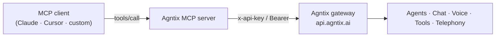

The **Agntix MCP server** exposes the Agntix platform as [Model Context Protocol](https://modelcontextprotocol.io) tools. Point an MCP-compatible client — Claude Desktop, Cursor, ChatGPT, or your own agent — at it, authenticate with an organization API key, and the assistant can manage your agents, run chat sessions, provision phone numbers, and inspect analytics using natural language.

Under the hood every MCP tool calls the same `api.agntix.ai` gateway documented in the [API Reference](/api-reference/introduction), with the **same authentication and RBAC scopes**. MCP is simply a second way to reach the platform — built for AI clients instead of your own code.

## What you can do

<CardGroup cols={2}>
  <Card title="Manage agents" icon="robot">
    List, create, update, and delete agents — including their model, system prompt, tools, and voice pipeline.
  </Card>
  <Card title="Drive chat sessions" icon="messages">
    Open sessions, send messages, and read transcripts on behalf of any agent.
  </Card>
  <Card title="Configure tools" icon="wrench">
    Inspect and wire up API/function tools that your agents call at runtime.
  </Card>
  <Card title="Operate telephony" icon="phone">
    Provision phone numbers and trigger outbound calls and campaigns.
  </Card>
  <Card title="Inspect analytics" icon="chart-line">
    Pull usage, cost, and call-outcome data to summarize or report on.
  </Card>
  <Card title="Stay in scope" icon="lock">
    Tools respect the scopes on your API key — a read-only key can only read.
  </Card>
</CardGroup>

## MCP vs. the REST API

Both reach the same platform through the same gateway. Choose based on _who_ is making the call.

|             | **MCP server**                              | **REST API**                             |
| ----------- | ------------------------------------------- | ---------------------------------------- |
| Caller      | An AI client (Claude, Cursor, your agent)   | Your own application code                |
| Interface   | Natural-language tool calls                 | HTTP requests you write                  |
| Auth        | Org API key / Bearer JWT                    | Org API key / Bearer JWT                 |
| Enforcement | Same RBAC scopes & rate limits              | Same RBAC scopes & rate limits           |
| Best for    | Letting an assistant operate Agntix for you | Deterministic, programmatic integrations |

<Note>
  Every MCP tool maps 1:1 to a documented REST endpoint. If you can't do it over the API, you can't do it over MCP — and vice versa.
</Note>

## How it works

1. Your MCP client connects to the Agntix MCP server and discovers the available tools (`tools/list`).
2. When the assistant decides to act, it issues a `tools/call`.
3. The MCP server forwards the call to the `api.agntix.ai` gateway with your API key.
4. The gateway applies the **same authentication, RBAC, and rate limits** as a direct API call, then returns the result to the assistant.

## Next steps

<CardGroup cols={3}>
  <Card title="Connect" icon="plug" href="/mcp/connect">
    Server URL, transport, and authentication.
  </Card>
  <Card title="Client setup" icon="circle-nodes" href="/mcp/clients">
    Configure Claude Desktop, Cursor, and others.
  </Card>
  <Card title="Tools reference" icon="list" href="/mcp/tools">
    Every tool and the endpoint it maps to.
  </Card>
</CardGroup>
